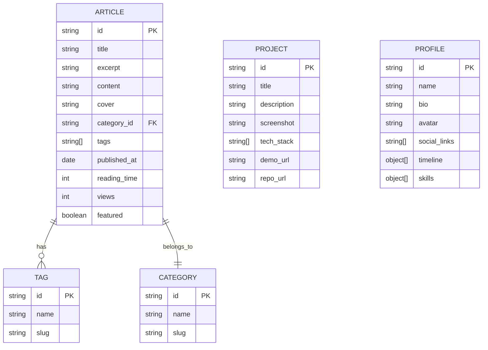

# 个人博客 - 技术架构文档

## 1. 架构设计

```mermaid
graph TD
    "前端层 React 18" --> "路由层 React Router"
    "路由层 React Router" --> "页面组件"
    "页面组件" --> "UI 组件库"
    "UI 组件库" --> "样式层 Tailwind CSS"
    "样式层 Tailwind CSS" --> "动效层 Framer Motion"
    "动效层 Framer Motion" --> "数据层 Mock 数据"
    "数据层 Mock 数据" --> "工具层"
    "工具层" --> "构建层 Vite"
```

纯前端架构,无后端服务,使用 Mock 数据模拟文章内容。所有数据以 TypeScript 模块形式静态存在,便于后续接入 CMS 或 API。

## 2. 技术说明

- **前端框架**: React 18 + TypeScript
- **构建工具**: Vite 5
- **样式方案**: Tailwind CSS 3 + CSS 变量(霓虹色彩系统)
- **路由方案**: React Router 6
- **动效方案**: Framer Motion(滚动触发、页面过渡、微交互)
- **图标库**: lucide-react
- **代码高亮**: react-syntax-highlighter
- **字体方案**: Google Fonts (Orbitron + Space Grotesk + JetBrains Mono + Noto Sans SC)
- **数据存储**: Mock 数据(TS 模块),后续可替换为 API
- **后端**: 无

## 3. 路由定义

| 路由 | 用途 |
|------|------|
| `/` | 首页:Hero + 精选文章 + 数据统计 + 技能矩阵 |
| `/blog` | 博客列表页:全部文章 + 筛选 + 搜索 |
| `/blog/:id` | 文章详情页:正文 + 目录 + 进度条 |
| `/about` | 关于页面:介绍 + 时间线 + 技能 + 联系方式 |
| `/projects` | 项目展示页:项目卡片网格 |
| `*` | 404 页面:霓虹风格错误页 |

## 4. 目录结构

```
src/
├── components/          # 通用组件
│   ├── layout/          # 布局组件(Navbar, Footer, Layout)
│   ├── ui/              # 基础 UI 组件(Button, Card, Tag, Badge)
│   ├── effects/         # 视觉特效(NoiseBackground, ParticleField, ScanLine, GradientMesh)
│   └── shared/          # 共享组件(SectionTitle, ScrollReveal, CustomCursor)
├── pages/               # 页面组件
│   ├── Home.tsx
│   ├── Blog.tsx
│   ├── ArticleDetail.tsx
│   ├── About.tsx
│   ├── Projects.tsx
│   └── NotFound.tsx
├── data/                # Mock 数据
│   ├── articles.ts
│   ├── projects.ts
│   └── profile.ts
├── hooks/               # 自定义 Hooks
│   ├── useScrollProgress.ts
│   ├── useActiveSection.ts
│   └── useMousePosition.ts
├── styles/              # 全局样式
│   └── globals.css
├── types/               # TypeScript 类型
│   └── index.ts
├── utils/               # 工具函数
├── App.tsx
└── main.tsx
```

## 5. 数据模型

### 5.1 数据模型定义



### 5.2 数据定义

使用 TypeScript 接口定义数据结构,以静态模块形式导出。文章正文使用 Markdown 字符串存储,渲染时解析为 HTML。初始数据包含 8-10 篇示例文章、4-6 个项目、完整的个人资料与时间线。

## 6. 视觉特效实现方案

### 6.1 背景系统
- **渐变网格**:CSS `radial-gradient` + `background-blend-mode` 实现流动网格
- **噪点纹理**:SVG `feTurbulence` 滤镜生成噪点,叠加 `mix-blend-mode: overlay`
- **扫描线**:CSS 重复线性渐变 + 动画位移
- **粒子流**:Canvas 或 Framer Motion 实现轻量粒子

### 6.2 玻璃拟态
- `backdrop-filter: blur(12px)` + 半透明背景 + 微光边框
- 悬停时增强发光:`box-shadow` 霓虹色扩散

### 6.3 字体系统
- CSS 变量统一管理字号、字重、行高
- 标题使用 `text-shadow` 实现霓虹发光
- 中文优先 Noto Sans SC,英文显示字体用 Orbitron

### 6.4 动效系统
- **页面过渡**:Framer Motion `AnimatePresence` 实现路由切换淡入淡出
- **滚动触发**:`whileInView` 实现模块进入视口动画
- **悬停**:`whileHover` 实现卡片缩放、发光
- **打字机**:自定义 Hook 实现逐字显示
